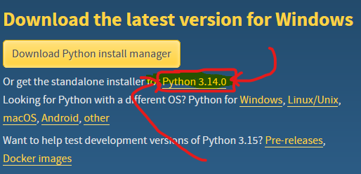

luv u <3

## Installing This Stuff

so! I'm about to give you an incredibly modern way to do python packages. This is cutting-edge (you'll be installing version 0.9.4) but it gives you an incredible amount of speed and control, and I'm going to make sure it's as easy for you to use as it is for me (I only learned this a month and a half ago).

## Pre-reqs:
### VS CODE
you already did this, but in a terminal, you can run `code .` to open the current folder in vscode.

----

### PYTHON
- Download at this link: https://www.python.org/downloads/
	- 
- Run the installer (should be in the dowloads with a name like `python-3.14.0-amd64.exe`)
- Make sure to tick this box:
	- 
- it'll install and you'll be good for the next chunk!
----
### UV
this is a python package manager, like Conda, except it's fast as hell :)

- open a Powershell terminal within this folder
- run `pip3 install uv`
	- (installs the tool itself via Python)
- run `uv sync`
	- (installs the python packages I prepped for you)
- and that's it! 
- If you ever need to add another package:
	- run `uv add <package-name>`
	- run `uv lock` (this just saves your settings so that the next time you want to run `uv sync` in a new project, you won't need to readd that package)

----
## Running Your Notebook
you're looking at this within VSCODE, right?

good. 

1. Open your notebook in VSCode
2. Select its kernel:
	- 
	- 
	- 
3. viola! do the things you were already gonna do :) 

## POST-SCRIPT
- `savefig()` can create folders and not clutter your root folder
- `main.py` gives you a template for running code on the command line- just run `python main.py` and see it.

